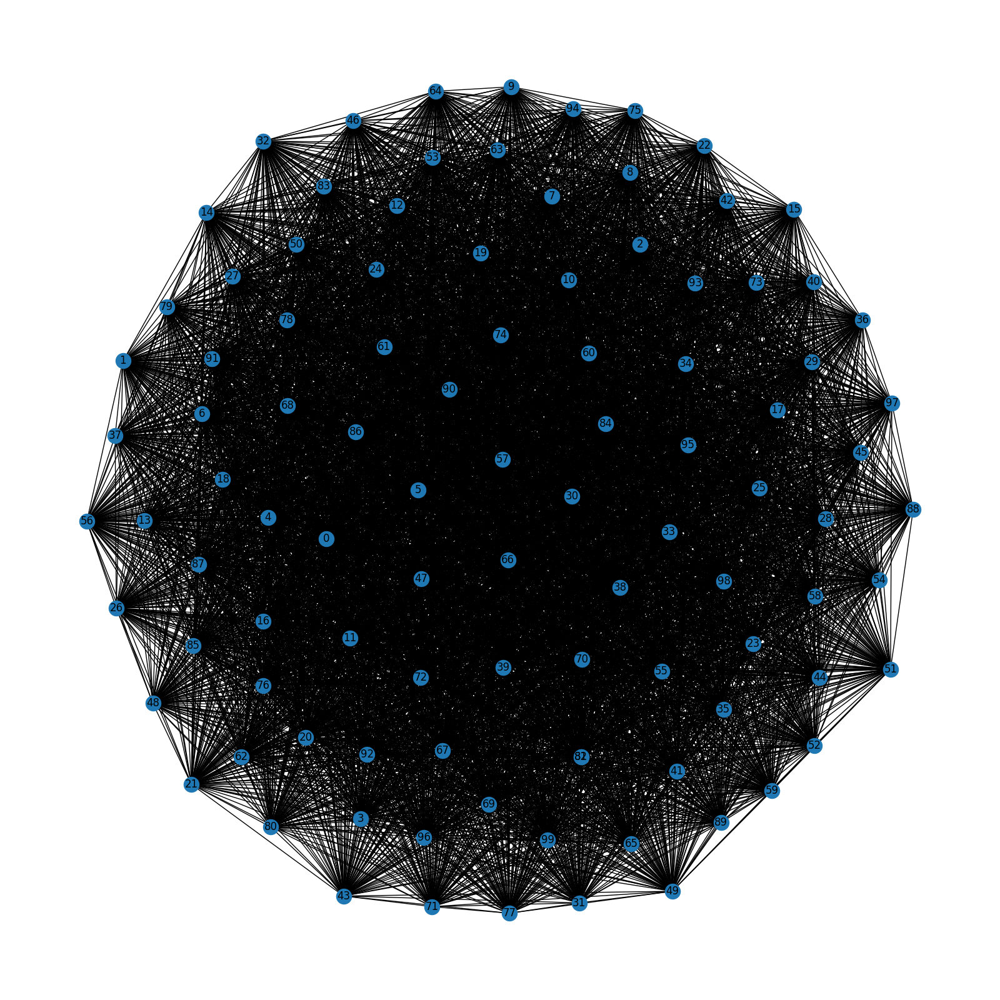
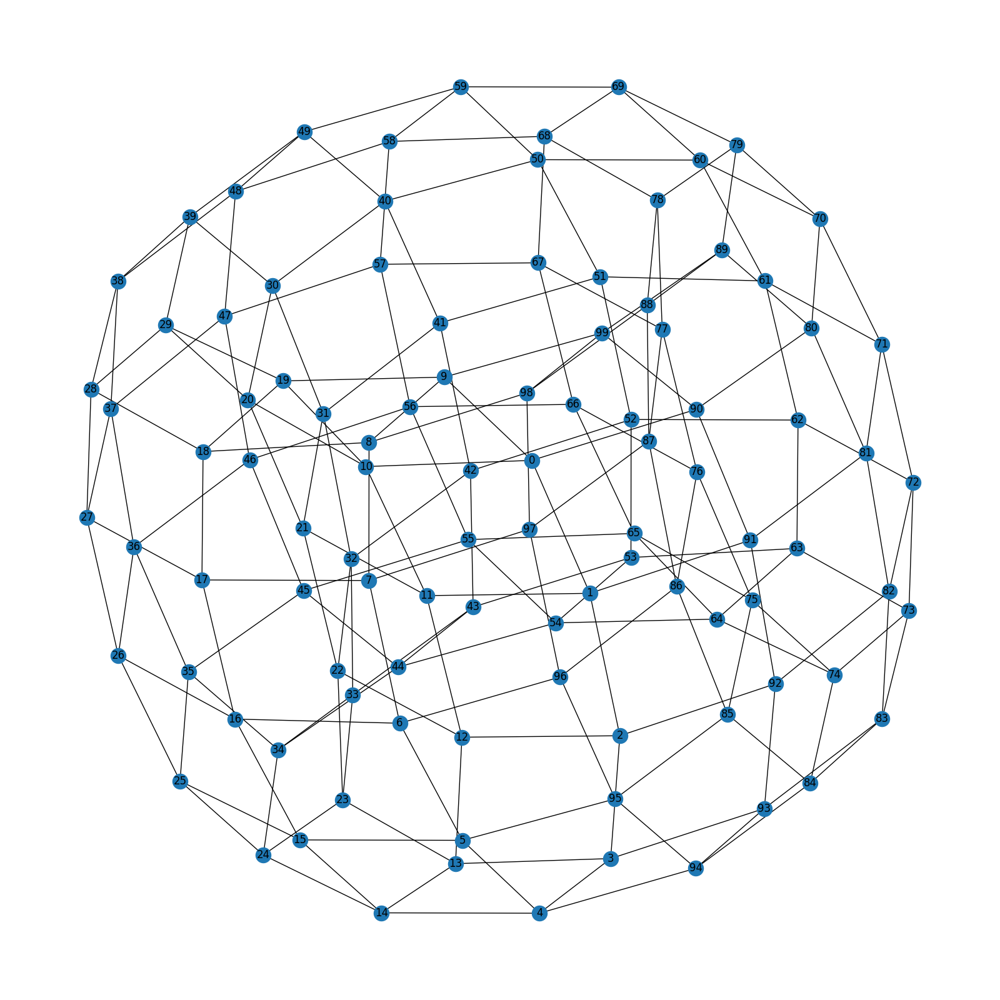
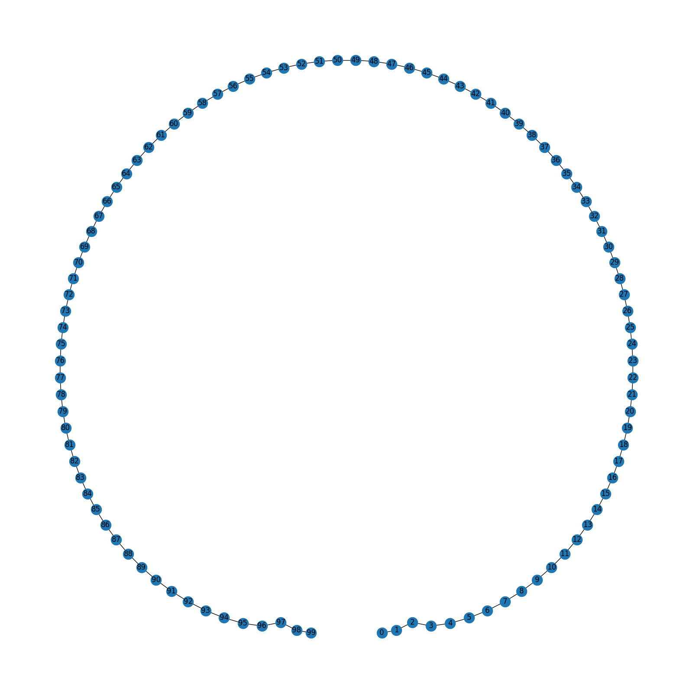
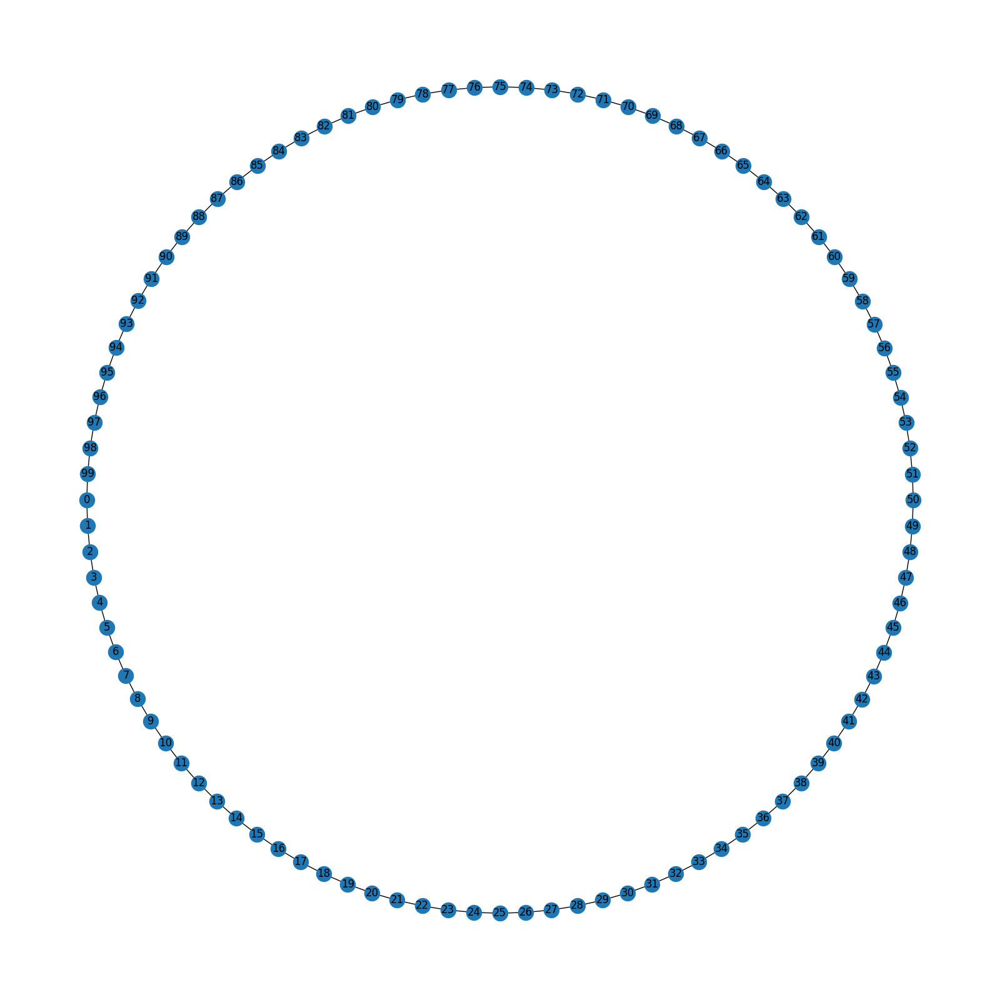
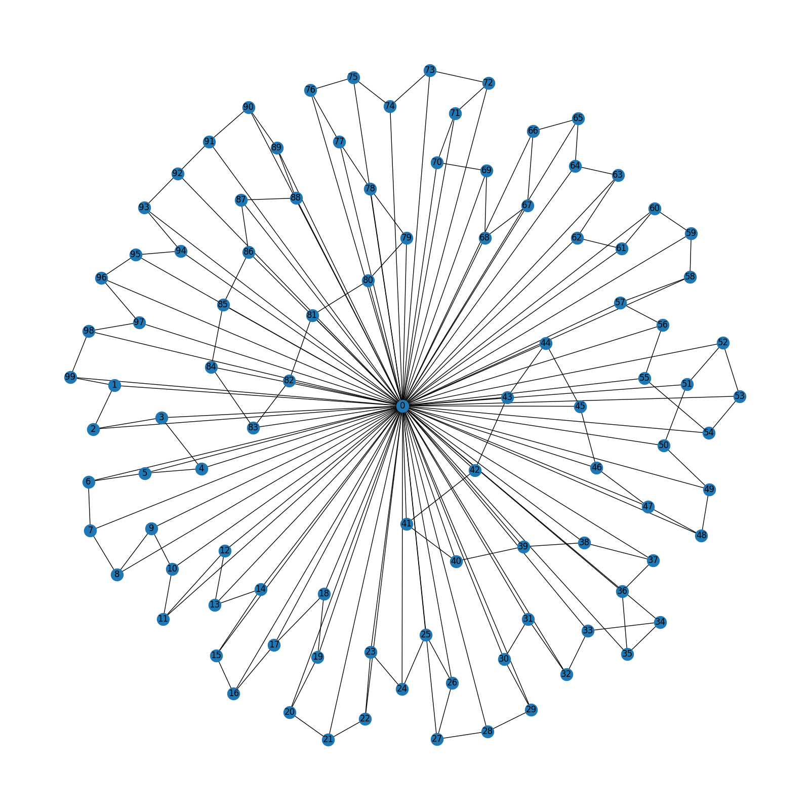
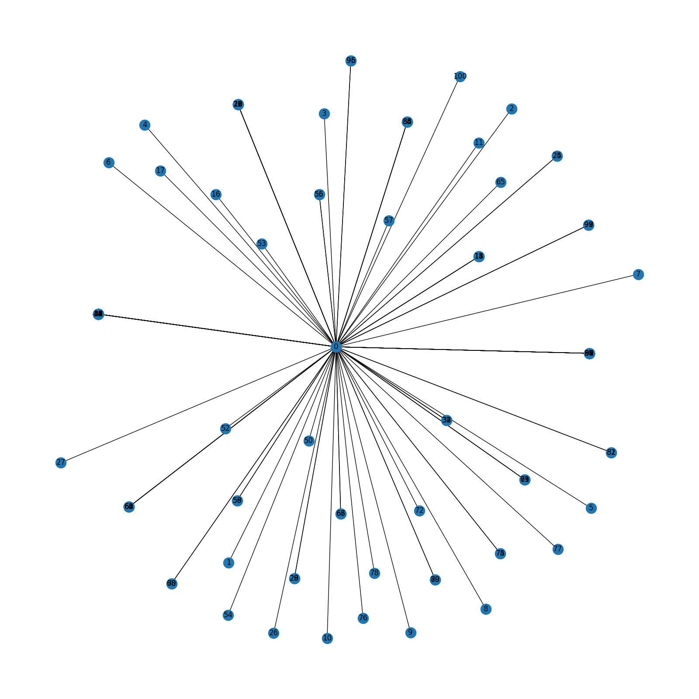
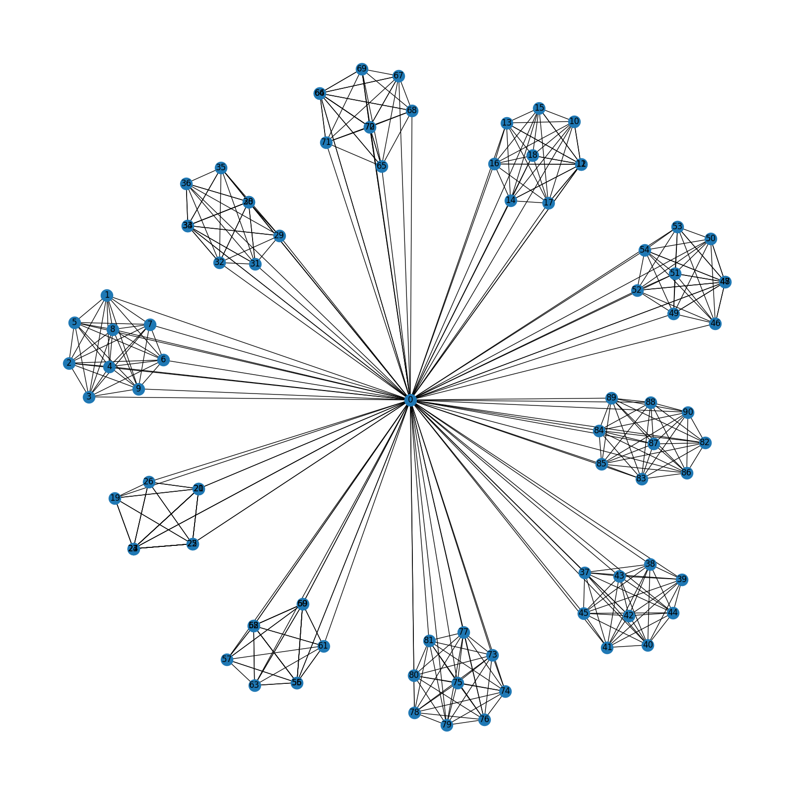
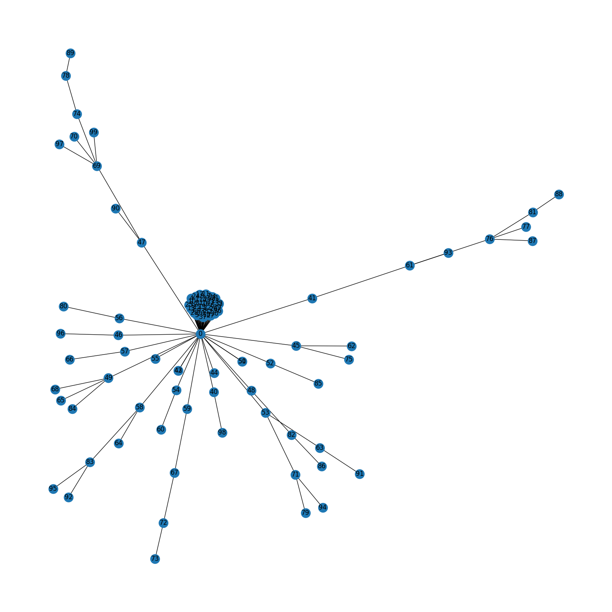
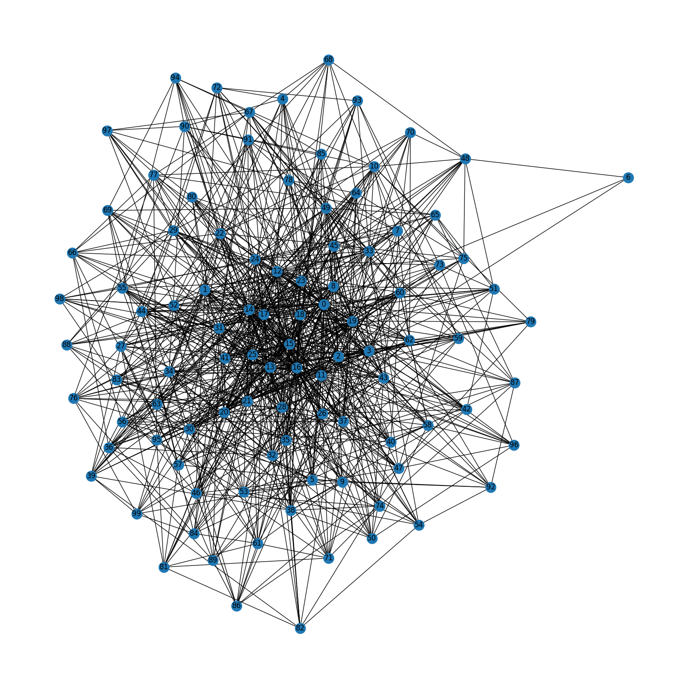
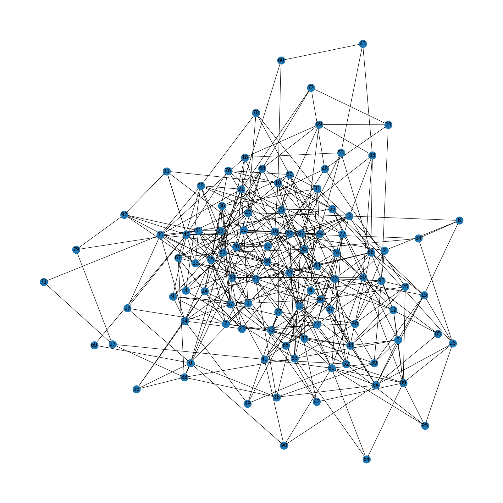

# Graph structures

We used ten different graph types to define spatial structures in our experiments.
The exact graphs used in our experiments are given in this repository: `experiments/2024-03-08-varied-interaction-matrices/hpc/config/spatial-structures/`

We include descriptions and visualizations of each graph type below.
All graph visualizations of our spatial structures can be found in `docs/graph-visualizations/`.

For graphs generated with a stochastic graph generation algorithm, we generated 20 graphs (one per replicate).
Each experiment used those 20 graphs for each replicate of that particular spatial structure regime.
Below, we include a representative visualize of each.

The code used to generate the graphs used in this work can be found in this repository in `scripts/SpatialStructure.py`.

## Well-mixed (fully connected)

A fully connected graph where each vertex is connected to all other vertices.

## Toroidal lattice

Vertices are organized into a toroidal grid where each vertex is connected to its four neighboring vertices.
The vertices in the top and bottom rows and left and right columns are connected, respectively.

This graph type is very commonly used in Artificial Life systems.

## Linear chain

Vertices are organized into a linear chain, where each vertex is connected to its two neighbors.

## Cycle

A linear chain graph, but the vertices at the two ends of the chain are connected.

## Wheel

A single hub vertex is connected to all vertices in a cycle comprising all other vertices in the graph.

## Star

A tree with one internal vertex, and all other vertices are leaves connected to the single internal vertex.

## Windmill

A graph with n size-k cliques that each share a single ``hub'' vertex.
For this work, n=10 and k=10.

## Comet-kite

A graph comprising a large fully connected set of core nodes with randomly attached ``tail'' nodes.
To generate a comet-kite graph, we construct a fully connected core, select t random nodes from the core to attach initial tail nodes to, and then sequentially attach additional nodes to randomly chosen tail nodes.
In this work, we used a core size of 40 nodes, attached 20 initial tail nodes, and added 40 additional tail nodes.

## Random Barabasi-Albert

A randomly generated, scale-free graph is constructed by sequentially attaching new nodes with m edges, which are preferentially connected to existing nodes with high degree.

## Random Waxman

A randomly generated graph is constructed by placing nodes uniformly at random in a 2-dimensional space.
Each pair of nodes distance d from one another are connected with probability $p = \beta e^{-d/\alpha L}$.
In this work, we used $\beta=0.4$ and $\alpha=0.2$.

